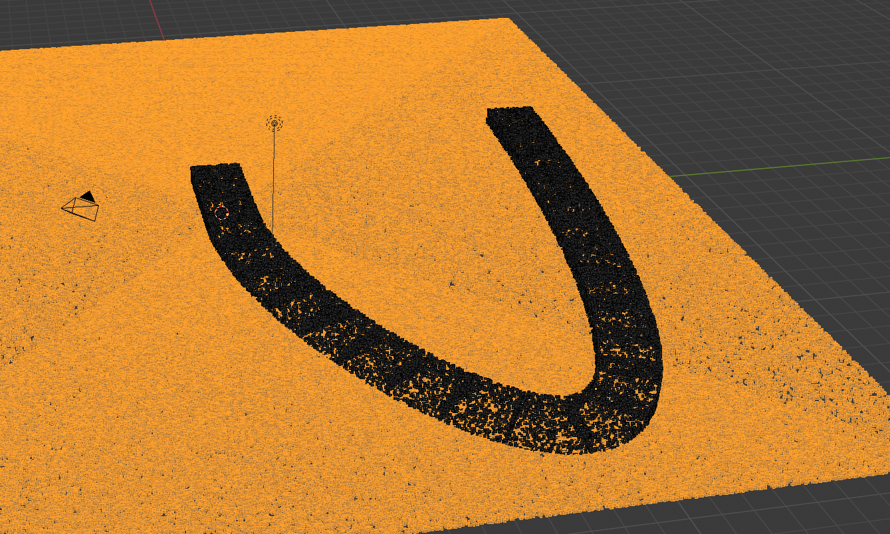

# Road segmentation/classification challenge
Given a set of point cloud, identify the roads and draw an ideal line segment. The closer the segment is to running through the middle of the road, the better the score.

## TODOs

[ ] more details here on scoring, where to implement and example data.
[ ] maybe convert to a similarity score instead of a distance
[ ] visually display ideal and actual segments and their scores
[ ] automated evaluator


Example cases you may need to solve for:




## Requirements
- Python ~3.10
- [Poetry](https://python-poetry.org/)
- [Git LFS](https://git-lfs.com/)
- Tested on Intel and ARM based Macs.

Set poetry configs:
```bash
poetry config virtualenvs.in-project true
```

## Suggested reading
[PLY file format](https://paulbourke.net/dataformats/ply/)

Note that we synthetically generated the point cloud. So each point in the point cloud file has more properties than it needs which is why you'll see some RGBa values as 0's and others are filled out. i.e. Road type points may have `road_colour` populated but not `ground_colour`. Due to the way the synthetic data was generated, the properties had to be on the same line. It is not recommended that you rely on these properties for all datasets.

## Quickstart
If your Python environment manager doesn't conflict with Poetry, you should have a `.venv` in this project folder. If not, it's probably somewhere else and you should check with `poetry env info` and set your IDE's python interpreter to that. In VSCode that's with `cmd/ctrl + SHIFT + p` -> "Python: Select Interpreter" -> <path to your interpreter from the previous command>

```bash
poetry install
poetry run jupyter lab
```
Jupyter lab should pop up in your browser and you can select `Main.ipynb` to start trying things out. The built in Jupyter notebook interpreter in VSCode also works. There's a known issue on MacOS where the window may still freeze even after you push "q" to quit. That's okay, just restart the kernel.

## Running snippets
```bash
poetry run python snippets/visualize_pc.py
```

## Running tests
```bash
poetry run pytest
```

## Directory layout
`model` - Model entities. Contains a `Point` class that you can use in your logic. Check out its properties. 
`snippets` - Little helpful code snippets if you want to run them individually to test stuff out, they're not part of the main app
`util` - Various helper utilities. One creates a O3d point cloud and the other is for parsing the custom PLY file and its properties.

## Troubleshooting
### What the heck are the visualization controls?
Taken from the [docs](https://www.open3d.org/docs/release/tutorial/visualization/visualization.html):
```text
-- Mouse view control --
  Left button + drag         : Rotate.
  Ctrl + left button + drag  : Translate.
  Wheel button + drag        : Translate.
  Shift + left button + drag : Roll.
  Wheel                      : Zoom in/out.

-- Keyboard view control --
  [/]          : Increase/decrease field of view.
  R            : Reset view point.
  Ctrl/Cmd + C : Copy current view status into the clipboard.
  Ctrl/Cmd + V : Paste view status from clipboard.

-- General control --
  Q, Esc       : Exit window.
  H            : Print help message.
  P, PrtScn    : Take a screen capture.
  D            : Take a depth capture.
  O            : Take a capture of current rendering settings.
```


### Remove your poetry env manually
```bash
rm -rf `poetry env info -p`
```

### Getting the python executable path for a different IDE
Use:
```bash
poetry env info --executable
```
to get the Python environment for VSCode if the IDE can't find it by itself / you aren't using JupyterLab

### Using a different Python environment
You may want to specify a different Python environment in Poetry:
```bash
poetry env use <Path to your python version>
```

### Open3D ML dependencies
There are several dependencies added manually e.g. addict, pillow etc because they weren't published to Pypi for Poetry to grab.
If you see errors importing open3d, just `poetry add` them.


## References
- Open3d docs - https://www.open3d.org/docs/release/
- Numpy - https://numpy.org/doc/
